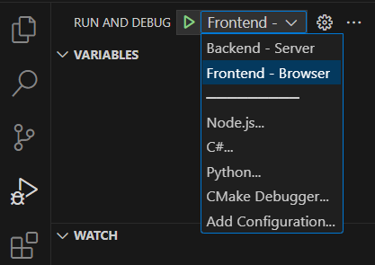

# 353-DBS-final
The final project  as part of CSC 353 - Database Systems, Fall 2023. A collaborative project by Cole Vulpis, Oma Hameed and Yumna Ahmed. 

# Introduction
This project makes use of available dining data on the Davidson College Campus to build a website through which students can see available food options. Using a MySQL database for data, the website allows filtering food items by allergies, price, or vegan/vegetarian diets.

The current filters include:
- Price
- Location
- Vegan Diet
- Vegetarian Diet
- Egg allergy
- Dairy free diet
- Gluten free diet

# To Run the Website
1. Clone/ fork this repository to get the files on your machine.
2. Open the files in Visual Studio Code.
3. Run `npm install` in the terminal to get all the dependencies listed in the project's description (package.json).
4. Run the `DataImporter.py` code file to populate the data.
5. In a new VS Code window, open the `example_frontend_backend` folder. Navigate to the debugger from the side panel.
6. From the dropdown menu in the debugger, first run the `Backend - Server` option and then the `Frontend - Server`.

7. The website should appear in a browser pop up window and can be used. 

# Software Needed to Run the Website
- DBeaver
- MySQL support
- Visual Studio Code
- Browser (Google Chrome recommended)
- Python support
- JavaScript support
- (recommended) GitHub / GitHub Desktop
